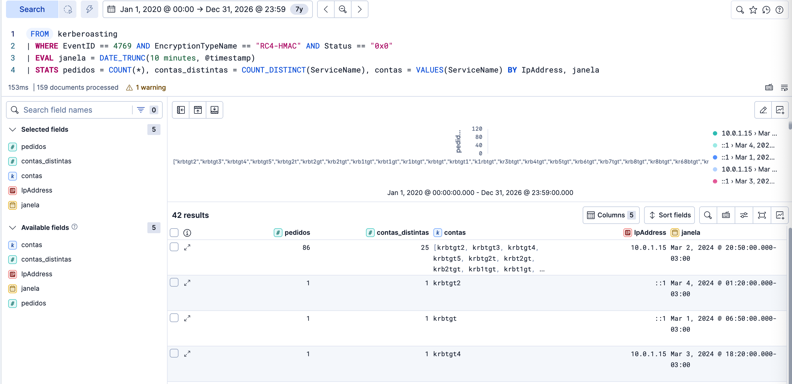
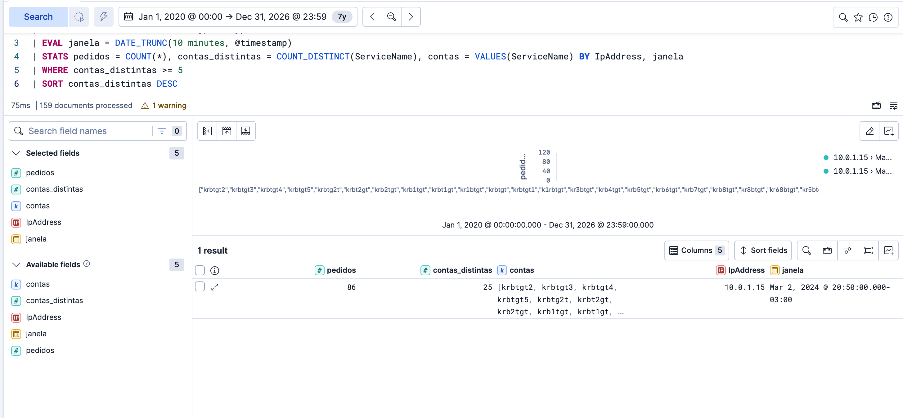

# Detecção de Kerberoasting — do dado bruto à regra Sigma

Estudo prático de detecção do ataque de **Kerberoasting** (MITRE ATT&CK [T1558.003](https://attack.mitre.org/techniques/T1558/003/)) usando Elastic Stack, a partir de um dataset de ataque real ingerido num lab local.

O objetivo deste repositório não é "rodei uma query e achei o ataque". É documentar o **raciocínio de detecção**: como uma primeira regra ingênua falha, como o próprio dado revela seu ponto cego, e por que a detecção comportamental é mais robusta que a detecção por assinatura.

> Parte de uma série pública documentando minha transição de carreira para Blue Team / SOC.

---

## O ataque, em uma frase

O Kerberoasting abusa de um comportamento **legítimo** do Kerberos: qualquer usuário autenticado pode pedir um ticket de serviço (TGS) para qualquer conta que tenha um SPN registrado. Parte desse ticket vem cifrada com o hash da senha da conta de serviço — então o atacante pede o ticket, leva para casa e **quebra a senha offline**, sem gerar mais nenhum log no domínio.

A janela de detecção é uma só: **o momento da requisição** — o evento **4769** no Domain Controller.

## O ambiente

| Componente | O que é |
|---|---|
| Elastic Stack (local, via Docker) | SIEM onde os logs foram ingeridos e consultados |
| Dataset | Logs de evento 4769 de um Domain Controller sob ataque (159 eventos) |
| Fonte | Dados de ataque sintéticos (Splunk Attack Range — `attackrange.local`) |

## A investigação, em três passos

### 1. A query ingênua — e por que ela é inútil

```
EventID: 4769 and EncryptionTypeName: "RC4-HMAC"
```

**Resultado: 159 de 159 eventos.** Praticamente todo o dataset é RC4. Uma regra que dispara em tudo não é uma regra — é ruído. Este é o falso positivo em massa que afoga um SOC.

### 2. A query de detecção — separando sinal de ruído

```
EventID: 4769 and EncryptionTypeName: "RC4-HMAC" and not ServiceName: krbtgt* and not ServiceName: *$ and Status: "0x0"
```

Os filtros e o porquê de cada um:

- `not ServiceName: krbtgt*` — a conta `krbtgt` aparece em toda autenticação Kerberos e **nunca** é o alvo real; é ruído estrutural.
- `not ServiceName: *$` — contas de máquina (terminam em `$`) pedem tickets o tempo todo em operação normal.
- `Status: "0x0"` — apenas requisições bem-sucedidas (o ticket foi de fato entregue).

**Resultado: 159 → 50.**

### 3. O ponto cego que o dado revelou

Ao agrupar os 50 resultados por `ServiceName`, os alvos eram: `kr1btgt`, `krbt2gt`, `krb5tgt`, `kr8btgt`... — **variações embaralhadas de "krbtgt"**.

O filtro `not ServiceName: krbtgt*` remove `krbtgt` escrito corretamente, mas deixa passar as letras fora de ordem. Não sei se foi de propósito, mas o dataset explorou exatamente essa suposição.

**A lição:** uma regra que filtra por **nome** quebra quando o atacante muda o nome. Uma regra que detecta o **comportamento** — uma origem pedindo muitos tickets RC4 em pouco tempo — não depende do nome e não tem esse ponto cego.

### 4. Parte 2: detecção pelo comportamento

Na parte 1 a regra dependia do nome da conta, e foi aí que ela furou. Aqui parei de olhar qual conta foi pedida e passei a olhar quem estava pedindo: agrupei os pedidos 4769 com RC4 por IP de origem, em janelas de 10 minutos, e contei quantas contas diferentes cada IP pediu.

O alerta dispara a partir de 5 contas diferentes na mesma janela. Escolhi contar contas diferentes, e não o total de pedidos, porque um serviço pode pedir ticket para a mesma conta o dia inteiro sem ser ataque. O que não é normal é uma origem pedir para muitas contas diferentes em pouco tempo.

**Resultado: 50 → 1.** Sobrou uma linha: o IP `10.0.1.15`, com 86 pedidos para 25 contas diferentes em 10 minutos. As variações de krbtgt que escaparam na parte 1 apareceram todas juntas, sem a regra saber o nome de nenhuma.





Query completa e limitações em [`queries/esql-comportamental.md`](queries/esql-comportamental.md).

## Conteúdo do repositório

```
queries/       As queries KQL e ES|QL, comentadas
sigma/         A regra de detecção em formato Sigma (portável entre SIEMs)
screenshots/   Evidências: o contraste 159 → 50 e o agrupamento por conta
```

## Referências

- MITRE ATT&CK — [T1558.003 Kerberoasting](https://attack.mitre.org/techniques/T1558/003/)
- Microsoft Learn — Detect and Remediate RC4 Usage in Kerberos
- Sean Metcalf (adsecurity.org) — Detecting Kerberoasting Activity
